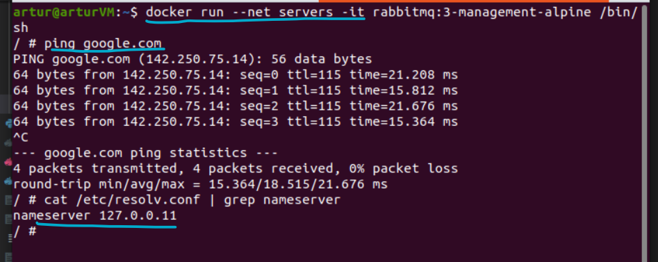

# My DNS-resolve notes
(and a bit of docker)

### A problem
If to create a docker container **without** specifying any network (i.e. the default
docker bridge network is set) it may happen that DNS resolution will not work:

although IP addresses can be pinged.

DNS resolution is configured in `/etc/resolv.conf` and
[docker documentation](https://docs.docker.com/config/containers/container-networking/#dns-services)
says that a container's `resolv.conf` is copied from the host's `resolv.conf` _by default_.
And here what is there:


comparing with the host's `resolv.conf`:


But if to create a container and set for it any other network (it can be even another
bridge network), ping works:
```bash
$ docker network create servers
# the rest if on the screenshot below
```

_(it may happen that sometimes a first `ping` try will not succeed, but the next one
should be fine)_

`127.0.0.11` - the default docker embedded DNS which is set for custom networks

[Another example of that](https://transang.me/dns-server-in-docker-container/)

> An important thing to mention - the host OS is on Hyper-V VM, so it may have
> some consequences for DNS

---

### resolv.conf and systemd-resolve
_I suspect_ that docker takes the configuration for `resolv` directly from the
output of `systemd-resolve` (the file is here - `/run/systemd/resolve/resolv.conf`)
Instead of the `/etc/resolv.conf`, which actually is a link to `/run/systemd/resolve/stub-resolv.conf`):


But the **actual** DNS is different for the **host**:
```bash
$ systemd-resolve --status
```


it works, but it is not reachable:
```bash
$ nslookup 172.17.33.225
# some valid response
$ ping -c 4 172.17.33.225
```


> _I suspect_ that due to this is a VM (Hyper-V in this case) and gateway/dns/dhcp is
> not reachable in a usual way docker cannot use it.

---

### How to make docker default bridge resolve DNS
To speficy some public DNS server for `docker0` (the default one) interface through
`systemd-resolve`:
```bash
$ sudo systemd-resolve --interface=docker0 --set-dns=1.1.1.1   # cloudflare for, example
```
then `/run/systemd/resolve/resolv.conf` and correspondingly docker default bridge resolv
will be looking like that:

> systemd-resolve takes DNS settings from all interfaces which have those, thus
> the only problem with that can be that there is a max number of possible `nameserver`
> entries - `MAXNS`, so one should keep an eye on that

From the [documentation](https://man7.org/linux/man-pages/man8/systemd-resolved.service.8.html)
about `systemd-resolve`:
> systemd-resolved maintains the
             /run/systemd/resolve/resolv.conf file for compatibility with
             traditional Linux programs. This file may be symlinked from
             /etc/resolv.conf and is always kept **up-to-date**, containing
             information about all known DNS servers. Note the file
             format's limitations: it **does not know a concept of
             per-interface DNS servers and hence only contains system-wide
             DNS server definitions**. Note that
             /run/systemd/resolve/resolv.conf should not be used directly
             by applications, but only through a symlink from
             /etc/resolv.conf. If this mode of operation is used local
             clients that bypass any local DNS API will also bypass
             systemd-resolved and will talk directly to the known DNS
             servers.