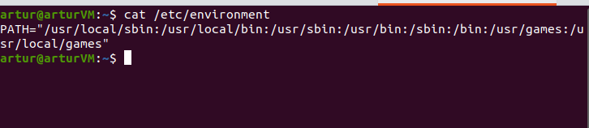

# Some observations and theory


## 1. Shell variables (ENV)

> [Source](https://askubuntu.com/questions/58814/how-do-i-add-environment-variables)

* To set a variable **only** for current shell:

```bash
~$ VARNAME='some value'
```

* To set it for current shell and **all processes** started from current shell

```bash
~$ export VARNAME='some value'
```

* To set it *permanently* for **all future bash sessions** (for current user)

```bash
$ cd $HOME
~$ echo VARNAME='some value' >> .bashrc
```

* To set it *permanently* **system wide**

```bash
$ cd /etc
$ echo VARNAME='some value' >> environment

# remember about access
```


Usually `/etc/environment` looks like this:


