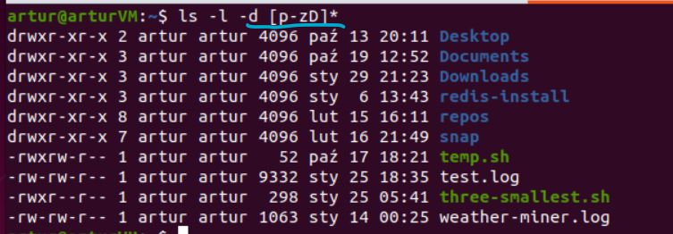
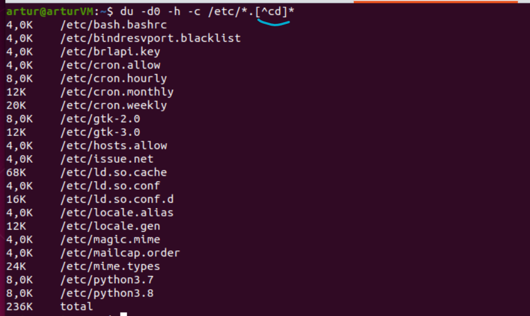
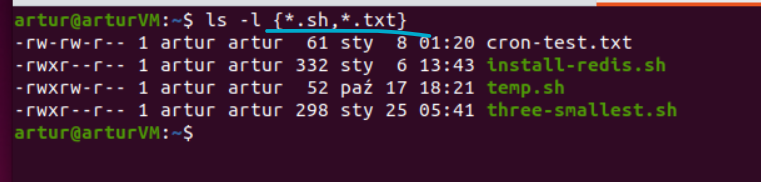

# My glob notes

**globbing** - matching specific types of patterns in bash

### 1. '?'
Used to match a single character, can be repeated
```bash
$ ls -d -l /s??
# some result
$ du -h -d0 -c /etc/???
# result on the image below
```


### 2. '*'
Used to match zero or more characters
```bash
$ grep "city" ./* 2> /dev/null
# goes through all files in the current directory
# the error output from trying to grep a directory is redirected into /dev/null

$ grep "city" ./*.*
# or to update the pattern to check only files (and directories) with an extension
```


### 3. '[]'
Used to specify a range of allowed characters for a single entry, can be repeated
```bash
$ ls -l -d [p-zD]*
# it can be both a continuous range of characters or a set of explicitly enumerated
# characters
```


### 4. '^' and '!'
Used to specify that matches everything not in a range
```bash
$ du -d0 -h -c /etc/*.[^cd]*
# OR
$ du -d0 -h -c /etc/*.[!cd]*
```


### 5. '{}'
Used to specify more than one match pattern to include files matching one of them
```bash
$ ls -l {*.sh,*.txt}
```


## `shopt`-enabled globs
Will be put someday, no need now for that