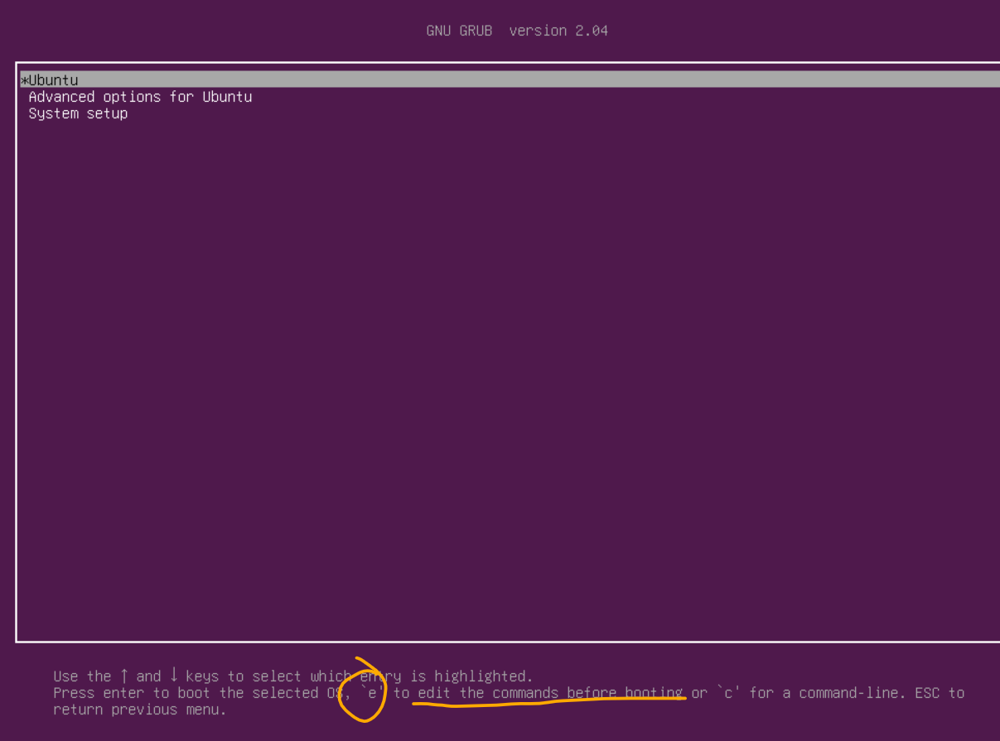
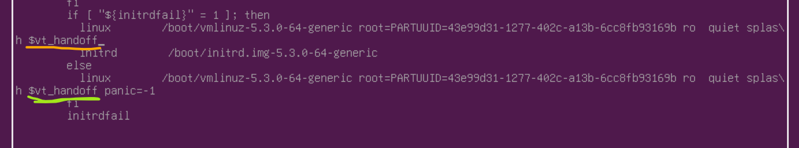
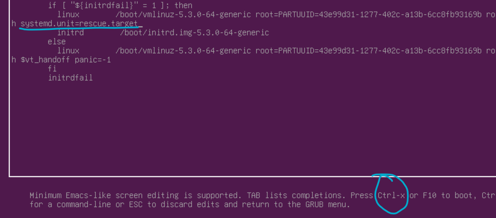
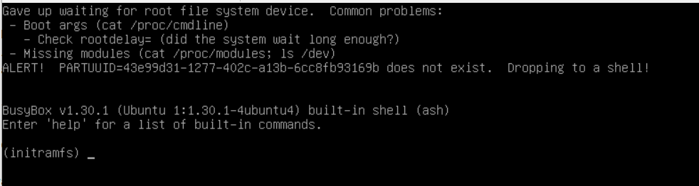
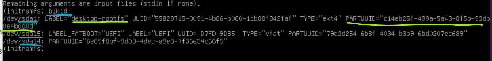
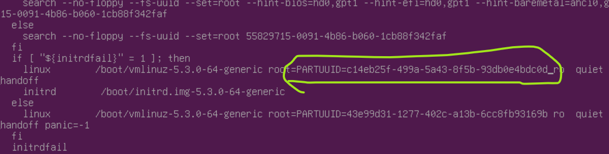
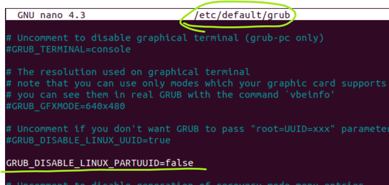
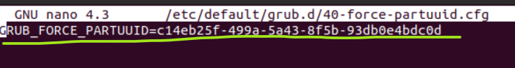

# My GRUB notes

### To go to the "rescue mode"
In GRUB menu go to the 'edit the commands before booting' view



depending on which option is going to be selected (but the orange one is usually default) find this part:

and remove it. Instead should be passed this:
```
systemd.unit=rescue.target
```

and exit by pressing `Ctrl+x` or `F10`. Then the GRUB menu will appear again where select the choice for which the
rescue mode change was made. After that the machine should be in the rescue mode


---

### 'ALERT! PARTUUID=<some UUID> does not exist'
Something like this should be shown


The message is pretty self-explanatory; some wrong boot PARTITION UUID value was provided for GRUB, so it cannot find
the disk which it can read from. In that shell there is a restricted set of available commands (like no editors at all) and it may be complicated
to make necessary changes from there

I did it in the GRUB edit menu. But before rebooting the machine run `blkid` to get the correct available PARTITION UUIDs
(there are two UUIDs, and one of the is for the partition and that one has to be passed)


and in the GRUB 'edit' menu:

`Ctrl+x` and now everything should be **almost** okay.

"Almost" because that was a one-time change and the next linux boot the issue will appear again. To update that completely
here are the steps:

1. Set `GRUB_DISABLE_LINUX_PARTUUID` to `false` in `/etc/default/grub`:

this will tell GRUB to search for the partition by its PARTITION UUID, which is read from a specific file.

2. Put the correct PARTITION UUID into `/etc/default/grub.d/40-force-partuuid.cfg`


3. Tell GRUB to update its config:
```bash
$ sudo update-grub
# this file is going to be updated - /boot/grub/grub.cfg
```

[How Lunix searches for root partition UUID](https://www.gnu.org/software/grub/manual/grub/grub.html#Root-Identifcation-Heuristics)

> NOTE: as in the manual above is said that a missing GRUB parameter means `false` then
> probably `40-force-partuuid.cfg` value was already applied (which was wrong), thus to be
> sure that I understand it well I would need to set `GRUB_DISABLE_LINUX_PARTUUID` to `true`
> and let GRUB search for the root partition only by `UUID` instead of `PARTUUID`. But next time