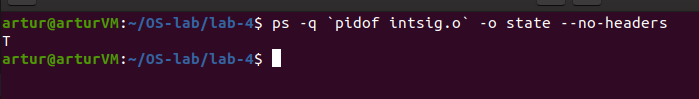

### Some Observations and theory

##### to use `ps` for showing a process' state

from `man ps`:

```bash
PROCESS STATE CODES
    Here are the different values that the s, stat and state output 
    specifiers (header "STAT" or "S") will display to describe the
    state of a process:

       D    uninterruptible sleep (usually IO)
       R    running or runnable (on run queue)
       S    interruptible sleep (waiting for an event to complete)
       T    stopped by job control signal
       t    stopped by debugger during the tracing
       W    paging (not valid since the 2.6.xx kernel)
       X    dead (should never be seen)
       Z    defunct ("zombie") process, terminated but not reaped by its parent

```


To show the state:

```bash
ps -q `pidof intsig.o` -o state --no-headers
```


