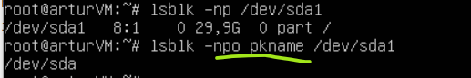
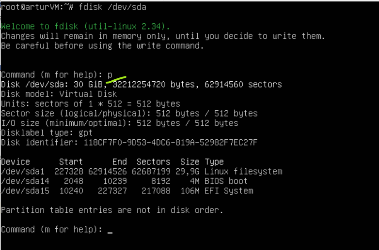
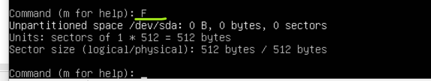
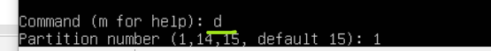
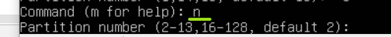
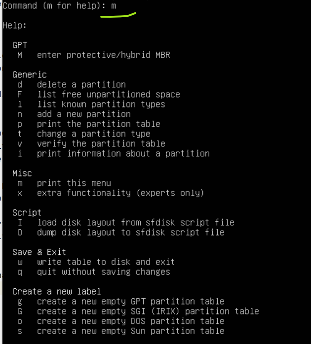

# My notes about partitioning

### Extend a partition
> for me it happened that way that my VM ran out of space and the regular UI boot was not able to complete.
> So I had to go into the **rescue mode** and the most of the screens are going to be presented from
> its shell

#### 1. In the shell find the device of the root partition
```bash
root# df -k /
# e.g. it returned /dev/sda1
root# lsblk -p -no pkname /dev/sda1
# which would return /dev/sda
```



#### 2. Run `fdisk` for the found device

*print the partition table for the device*

> by typing `m` `fdisk` will show the list of available commands


#### 3. Check whether there is a free unpartitioned space

> next steps assume that there is some space and there is a need to extend a partition

#### 4. Delete the partition which is going to be removed


#### 5. Add the partition back specifying changed sectors bounds



###### List of commands
